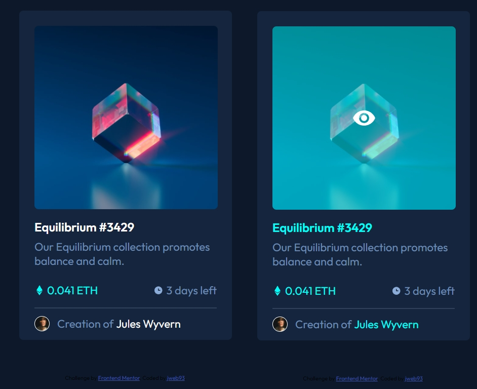

# Frontend Mentor - NFT preview card component solution

This is a solution to the [NFT preview card component challenge on Frontend Mentor](https://www.frontendmentor.io/challenges/nft-preview-card-component-SbdUL_w0U). Frontend Mentor challenges help you improve your coding skills by building realistic projects. 

## Table of contents

- [Overview](#overview)
  - [The challenge](#the-challenge)
  - [Screenshot](#screenshot)
  - [Links](#links)
- [My process](#my-process)
  - [Roadmap](#roadmap)
  - [Built with](#built-with)
  - [What I learned](#what-i-learned)
  - [Continued development](#continued-development)
- [Author](#author)

## Overview

### The challenge

Users should be able to:

- View the optimal layout depending on their device's screen size
- See hover states for interactive elements

### Screenshot



### Links

- Solution URL: [Add solution URL here](https://your-solution-url.com)
- Live Site URL: [Add live site URL here](https://your-live-site-url.com)

## My process

### Roadmap

- Notion: https://www.notion.so/NFT-preview-card-component-b91e8ca02e89466799fee4d6480e7bab

### Built with

- Semantic HTML5 markup
- CSS custom properties
- Flexbox

### What I learned

```css
.card__img a:hover{
                background-color: var(--mid-cyan);
                background-image: url("/assets/icon-view.svg");
                background-repeat: no-repeat;
                background-size: scale-down;
                background-position: center;
            }
```

### Continued development

I learned how to add a little (background-size: scale-down;) icon (icon-view.svg) on the center of a hovered link block. I would like to know how to add more than one icon, with different sizes and positions in a hovered link.

## Author

- Website - not yet
- Frontend Mentor - [@jweb93](https://www.frontendmentor.io/profile/jweb93)
- Twitter - [@javier_vln](https://twitter.com/javier_vln)


